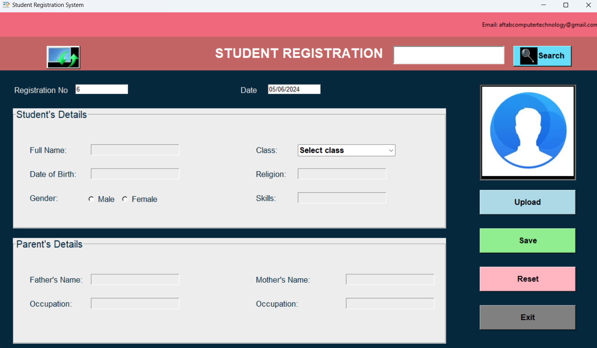
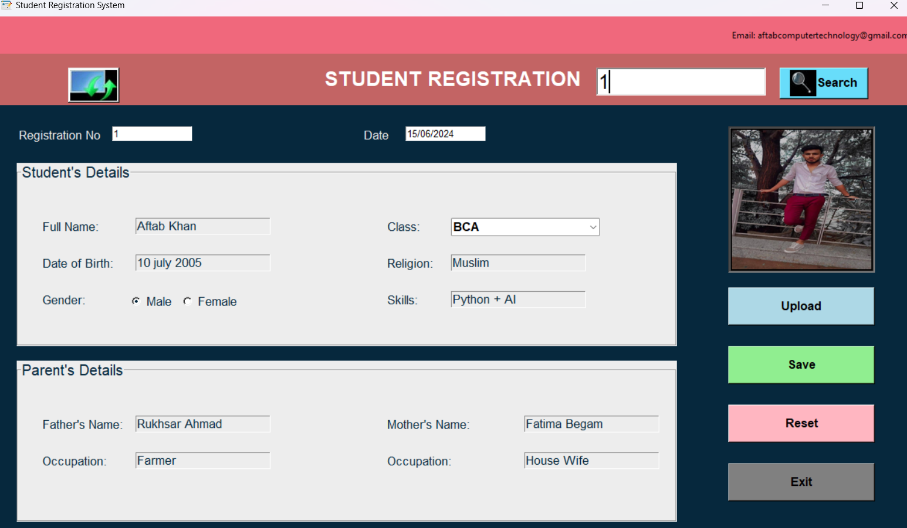

# Student Registration System

This is a simple student registration system built using Python and Tkinter. It allows users to register students by providing their personal and parent details along with an optional image upload.

## Features

- Register students with their personal and parent details.
- Automatically generates a registration number and date.
- Allows users to upload an image for each student.
- Supports searching for students by registration number.
- Updates student details.

## Requirements

- Python 3.x
- Tkinter
- Pillow (PIL)
- MySQL Connector
- SQL
  This project is needed to create the database and table . to See the [SQL](SQL) file for details.
## Installation

1. Clone the repository:
    ```bash
    git clone https://github.com/yourusername/student-registration-system.git
    ```

2. Install the required Python packages:
    ```bash
    pip install -r requirements.txt
    ```

3. Set up your MySQL database and update the connection details in the code (`main.py`).

4. Run the application:
    ```bash
    python main.py
    ```

## Screenshots




## License

This project is licensed under the MIT License. See the [LICENSE](LICENSE) file for details.

## Acknowledgements

- [Tkinter](https://docs.python.org/3/library/tkinter.html) for the GUI framework.
- [Pillow](https://python-pillow.org/) for image processing.
- [MySQL Connector](https://dev.mysql.com/doc/connector-python/en/) for connecting to MySQL database.

## Author

AFTAB ALAM
